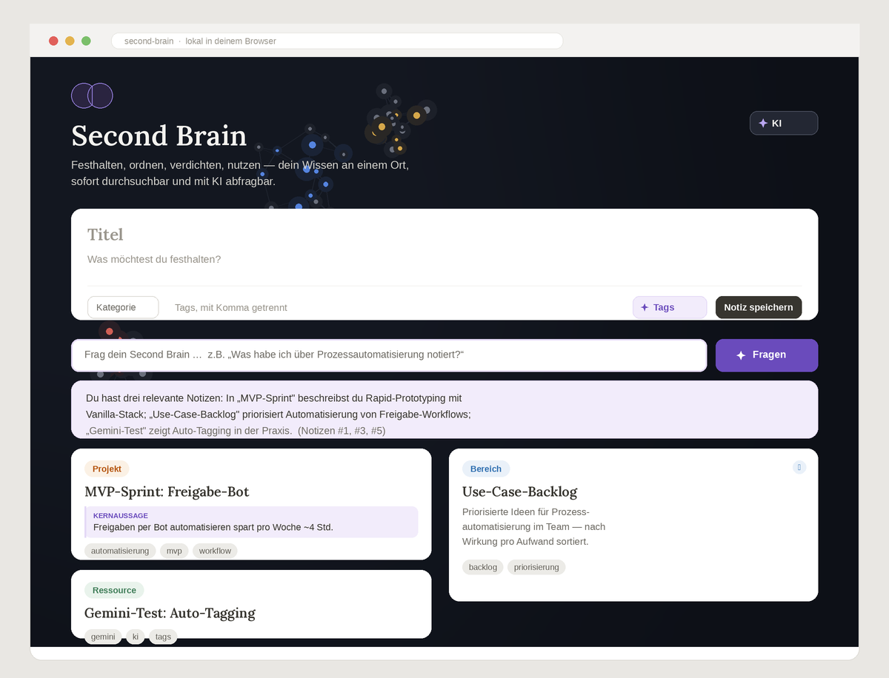

# 🧠 Second Brain

Eine schlanke Notizen-Web-App zum Festhalten, Verschlagworten und Durchsuchen von Gedanken – mit **KI-gestütztem Auto-Tagging**. Kein Framework, kein Backend, kein Login: einfach öffnen und loslegen.

**▶️ Live-Demo:** https://enriquee-lab.github.io/second-brain/

---

## Features

- **Notizen anlegen** mit Titel, Inhalt und Tags
- **KI-Auto-Tagging** – auf Knopfdruck schlägt die Google-Gemini-API passende Tags vor
- **Volltextsuche** über Titel, Inhalt und Tags
- **Tag-Filter** per Klick auf einen Tag-Chip
- **Galerie-Ansicht** im editorialen Masonry-Layout
- **Lokale Speicherung** im Browser (`localStorage`) – die Daten bleiben auf deinem Gerät
- **Responsive** und barrierearm (Fokus-Ringe, `prefers-reduced-motion`)

## Vorschau

<!-- Tipp: Screenshot der App hier einfügen. Auf GitHub den README-Bearbeiten-Stift öffnen und ein Bild per Drag & Drop hineinziehen (dabei wird der Bildlink automatisch eingesetzt). -->

## KI-Auto-Tagging einrichten (optional)

Das Auto-Tagging nutzt die **Google-Gemini-API**, die einen kostenlosen Tarif ohne Kreditkarte bietet.

1. Kostenlosen API-Key erstellen bei [Google AI Studio](https://aistudio.google.com/apikey)
2. In der App oben rechts auf **✨ KI** klicken
3. Key einfügen und **Speichern**

Der Key wird ausschließlich lokal in deinem Browser gespeichert und landet nie im Repository.

## Tech-Stack

- **HTML, CSS, JavaScript** (Vanilla, bewusst ohne Framework)
- **Google Gemini API** für das KI-Auto-Tagging
- **GitHub Pages** für das Hosting

## Lokal starten

Kein Build-Schritt nötig – einfach die Datei `index.html` im Browser öffnen.

## Roadmap

- [ ] KI-Funktion optional über eine Serverless-Funktion (z. B. Vercel), damit auch Besucher ohne eigenen Key taggen können
- [ ] Notizen exportieren und importieren (JSON)
- [ ] Bestehende Notizen bearbeiten

---

Gebaut als iteratives, KI-unterstütztes Lernprojekt.
